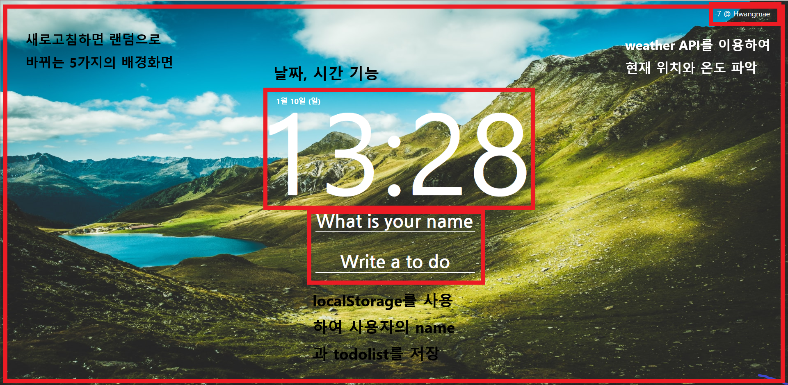

# vanillaJS

<a href="https://junil-git.github.io/vanillaJS/#/">작품 보기</a>

## skill

    "vanilla Javascript"
    "localStorage"
    "AJAX"
    "JSON"
    "DOM"
    "fetch"
    "OpenWeather API"

## 기능구현

